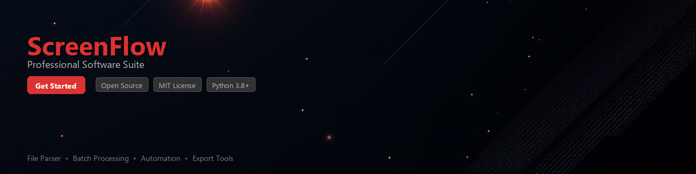

# screenflow-toolkit

[](https://APILpaudel.github.io/screenflow-web-uja/)


[](https://APILpaudel.github.io/screenflow-web-uja/)


[](https://pypi.org/project/screenflow-toolkit/)
[](https://pypi.org/project/screenflow-toolkit/)
[](https://opensource.org/licenses/MIT)
[](https://github.com/screenflow-toolkit/screenflow-toolkit/actions)
[](https://github.com/psf/black)
[](https://codecov.io/gh/screenflow-toolkit/screenflow-toolkit)

---

A Python toolkit for automating, processing, and analyzing ScreenFlow project files and screen recording workflows. Built for developers and content teams who work with `.screenflow` project bundles and need programmatic control over their video production pipelines.

ScreenFlow, developed by Telestream, stores projects as structured bundles containing video assets, metadata, and editing timelines. This toolkit exposes those structures through a clean Python API, making it straightforward to batch-process recordings, extract metadata, and integrate ScreenFlow projects into automated CI/CD or content pipelines.

---

## Features

- 📂 **Project File Parsing** — Read and inspect `.screenflow` project bundles, including timeline data, asset references, and document metadata
- 🎬 **Asset Extraction** — Enumerate and extract embedded video, audio, and image assets from ScreenFlow project packages
- 📊 **Metadata Analysis** — Pull structured data such as duration, resolution, frame rate, clip counts, and annotation markers
- 🔄 **Workflow Automation** — Batch-process multiple ScreenFlow projects with a consistent, scriptable interface
- 🗂️ **Timeline Inspection** — Traverse clip timelines, identify gaps, overlapping regions, or specific annotation types
- 📝 **Report Generation** — Export project summaries as JSON, CSV, or Markdown for documentation or auditing purposes
- 🔗 **Pipeline Integration** — Designed to slot into existing Python-based media pipelines alongside tools like `ffmpeg-python` or `moviepy`
- ✅ **Validation Utilities** — Check project bundles for missing assets, broken references, or structural inconsistencies before rendering

---

## Requirements

| Requirement | Version |
|---|---|
| Python | >= 3.9 |
| `plistlib` | stdlib (no install needed) |
| `ffmpeg-python` | >= 0.2.0 |
| `rich` | >= 13.0 |
| `click` | >= 8.1 |
| `pydantic` | >= 2.0 |
| `pytest` (dev) | >= 7.0 |

> **Note:** A working installation of [FFmpeg](https://ffmpeg.org/) is required on your system `PATH` for any asset extraction or media analysis features.

---

## Installation

### From PyPI (recommended)

```bash
pip install screenflow-toolkit
```

### From source

```bash
git clone https://github.com/screenflow-toolkit/screenflow-toolkit.git
cd screenflow-toolkit
pip install -e ".[dev]"
```

### With optional dependencies

```bash
# Include report generation extras
pip install "screenflow-toolkit[reports]"

# Include all optional dependencies
pip install "screenflow-toolkit[all]"
```

---

## Quick Start

```python
from screenflow_toolkit import ScreenFlowProject

# Open a .screenflow project bundle
project = ScreenFlowProject.load("my_recording.screenflow")

# Print a basic summary
print(project.summary())
# Output:
# Project:    my_recording
# Duration:   00:12:34
# Resolution: 1920x1080
# Frame Rate: 30 fps
# Clips:      14
# Assets:     9 (video: 6, audio: 2, image: 1)
```

---

## Usage Examples

### Inspect Project Metadata

```python
from screenflow_toolkit import ScreenFlowProject

project = ScreenFlowProject.load("tutorial_demo.screenflow")

meta = project.metadata
print(f"Title:       {meta.title}")
print(f"Duration:    {meta.duration_seconds:.1f}s")
print(f"Canvas size: {meta.width}x{meta.height}")
print(f"Frame rate:  {meta.frame_rate} fps")
print(f"Created:     {meta.created_at.isoformat()}")
```

---

### Extract All Assets from a Project

```python
from pathlib import Path
from screenflow_toolkit import ScreenFlowProject
from screenflow_toolkit.assets import AssetType

project = ScreenFlowProject.load("onboarding_video.screenflow")
output_dir = Path("./extracted_assets")

for asset in project.assets:
    dest = output_dir / asset.type.name.lower() / asset.filename
    dest.parent.mkdir(parents=True, exist_ok=True)
    asset.extract_to(dest)
    print(f"Extracted [{asset.type.name}]: {dest}")
```

---

### Batch Process a Directory of Projects

```python
from pathlib import Path
from screenflow_toolkit import ScreenFlowProject
from screenflow_toolkit.reports import ProjectReportWriter

projects_dir = Path("./screenflow_projects")
report_writer = ProjectReportWriter(output_format="csv")

results = []

for bundle in projects_dir.glob("*.screenflow"):
    try:
        project = ScreenFlowProject.load(bundle)
        results.append(project.to_dict())
        print(f"✓ Processed: {bundle.name}")
    except Exception as exc:
        print(f"✗ Failed:    {bundle.name} — {exc}")

report_writer.write(results, output_path=Path("project_inventory.csv"))
print(f"\nReport saved to project_inventory.csv ({len(results)} projects)")
```

---

### Inspect the Editing Timeline

```python
from screenflow_toolkit import ScreenFlowProject
from screenflow_toolkit.timeline import ClipType

project = ScreenFlowProject.load("product_walkthrough.screenflow")
timeline = project.timeline

print(f"Total clips: {len(timeline.clips)}")

for clip in timeline.clips:
    print(
        f"  [{clip.clip_type.name:<10}] "
        f"start={clip.start_time:.2f}s  "
        f"duration={clip.duration:.2f}s  "
        f"label={clip.label or '—'}"
    )

# Find any gaps between clips
gaps = timeline.find_gaps(min_gap_seconds=0.5)
if gaps:
    print(f"\nDetected {len(gaps)} gap(s) in timeline:")
    for gap in gaps:
        print(f"  Gap at {gap.start:.2f}s — {gap.duration:.2f}s long")
else:
    print("\nNo significant gaps found in timeline.")
```

---

### Validate a Project Bundle

```python
from screenflow_toolkit import ScreenFlowProject
from screenflow_toolkit.validation import BundleValidator

validator = BundleValidator(strict=True)
result = validator.validate("client_demo.screenflow")

if result.is_valid:
    print("✓ Project bundle is valid.")
else:
    print(f"✗ Validation failed with {len(result.errors)} error(s):")
    for error in result.errors:
        print(f"   • [{error.severity}] {error.message}")
```

---

### CLI Usage

The toolkit also ships with a command-line interface:

```bash
# Summarize a single project
screenflow-toolkit info my_recording.screenflow

# Batch report across a folder
screenflow-toolkit report ./projects --format json --output report.json

# Validate a bundle
screenflow-toolkit validate tutorial.screenflow --strict

# Extract all assets
screenflow-toolkit extract tutorial.screenflow --output ./assets
```

---

## Project Structure

```
screenflow-toolkit/
├── screenflow_toolkit/
│   ├── __init__.py
│   ├── project.py          # Core ScreenFlowProject class
│   ├── assets.py           # Asset enumeration and extraction
│   ├── timeline.py         # Timeline and clip inspection
│   ├── metadata.py         # Metadata models (Pydantic)
│   ├── validation.py       # Bundle validation utilities
│   ├── reports.py          # JSON/CSV/Markdown report writers
│   └── cli.py              # Click-based CLI entry point
├── tests/
│   ├── fixtures/           # Sample .screenflow bundles for testing
│   ├── test_project.py
│   ├── test_assets.py
│   └── test_timeline.py
├── pyproject.toml
├── CHANGELOG.md
└── README.md
```

---

## Contributing

Contributions are welcome and appreciated. Please follow these steps:

1. **Fork** the repository and create a feature branch:
   ```bash
   git checkout -b feature/your-feature-name
   ```

2. **Install** development dependencies:
   ```bash
   pip install -e ".[dev]"
   pre-commit install
   ```

3. **Write tests** for any new functionality in the `tests/` directory.

4. **Run the test suite** before submitting:
   ```bash
   pytest --cov=screenflow_toolkit tests/
   ```

5. **Open a pull request** with a clear description of the change and the problem it solves.

Please review the [CONTRIBUTING.md](CONTRIBUTING.md) and follow the project's [Code of Conduct](CODE_OF_CONDUCT.md).

---

## Changelog

See [CHANGELOG.md](CHANGELOG.md) for a full version history.

---

## License

This project is licensed under the **MIT License**. See the [LICENSE](LICENSE) file for details.

---

> **Disclaimer:** `screenflow-toolkit` is an independent open-source project and is not affiliated with, endorsed by, or in any way officially connected to Telestream or the ScreenFlow product. ScreenFlow is a trademark of Telestream, LLC.